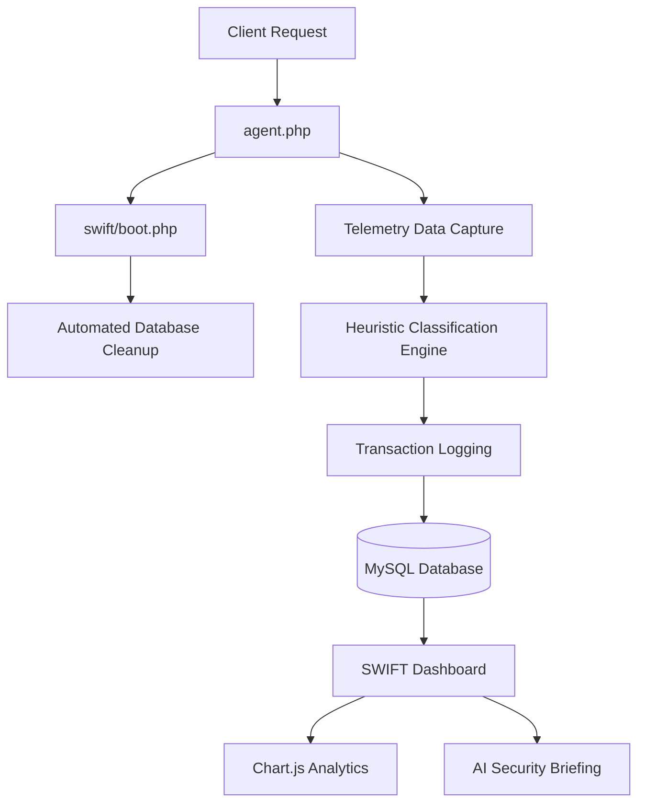

<p align="center">
  
</p>

# SWIFT: Smart Web Intelligence Framework & Tracker

SWIFT is a passive, high-performance security intelligence platform designed for forensic-level telemetry collection and behavioral threat analysis in PHP-based web environments. It operates synchronously during HTTP requests, providing real-time visibility into the security posture of an application without the need for background services or external dependencies.

## Project Structure

```text
.
├── agent.php           # Entry point for telemetry capture
├── 404.html            # Redesigned framework error page
├── swift/
│   ├── boot.php        # Core framework bootstrap & maintenance
│   ├── config.php      # Global security & API configuration
│   ├── schema.sql      # Database initialization schema
│   ├── Core/           # Intelligence Core (PHP Helpers)
│   │   ├── Analyzer.php      # Heuristic detection logic
│   │   ├── Database.php      # Singleton PDO wrapper
│   │   ├── GroqService.php   # AI analysis integration
│   │   ├── Logger.php        # Transaction logging system
│   │   └── Telemetry.php     # Data collection helpers
│   └── dashboard/      # Security Operations Center (UI)
│       ├── api.php           # Dashboard data endpoint
│       ├── docs.php          # Integrated documentation portal
│       ├── index.php         # Main analytics monitor
│       ├── info.php          # Framework metadata
│       ├── login.php         # Authentication gateway
│       ├── settings.php      # System configuration UI
│       └── assets/           # UI static resources
└── vulnlab/            # Vulnerability Simulation Lab
    ├── header.php
    ├── index.php             # Vulnerability overview
    ├── lfi_lab.php           # Local File Inclusion lab
    ├── rce_lab.php           # Remote Code Execution lab
    ├── sql_lab.php           # SQL Injection lab
    └── xss_lab.php           # Cross-Site Scripting lab
```

## System Architecture

The following diagram illustrates the lifecycle of a request within the SWIFT ecosystem.



## Core Functionality

### 1. Passive Telemetry Agent (agent.php)

The agent is the primary entry point for integration. By including `agent.php` at the top of an application, it hooks into the request lifecycle to capture:

- Source IP and Geographic Origin.
- Request Method and URI.
- Raw HTTP Headers.
- POST/GET Payloads.

### 2. Heuristic Analysis Engine (Analyzer.php)

The Intelligence Core evaluates every request against a set of complex signatures and behavior heuristics:

- **Signature Matching**: Identifies SQL Injection, Cross-Site Scripting (XSS), Local File Inclusion (LFI), and Command Injection patterns.
- **Header Analysis**: Inspects User-Agents and sensitive header fields for anomalies.
- **Risk Scoring**: Assigns an integer score (0-100) and classifies the event as Normal, Suspicious, or Malicious.

### 3. Analytics Dashboard

The dashboard provides a real-time command center for security operators:

- **Traffic Analysis**: Interactive line charts showing request velocity.
- **Threat Landscape**: Doughnut charts categorized by security classification.
- **Attack Vector Tracking**: Bar charts highlighting the most frequent vulnerability triggers.
- **Live Stream**: A forensic log view featuring Dracula-themed syntax highlighting for clear payload inspection.

### 4. Technical Documentation (docs.php)

The system includes an integrated Documentation Portal accessible via the dashboard. This portal provides:

- Installation and deployment guidelines.
- Technical specifications of the detection signatures.
- Overview of the AI analysis capabilities.
- Component-level documentation for the navigation and charts.

### 5. Automated Intelligence (AI Briefing)

SWIFT integrates with the Groq Cloud API to provide natural language security briefings. It synthesizes complex telemetry data into actionable summaries using Large Language Models (LLMs).

## Installation

1. Copy the `swift` directory and `agent.php` to your web server.
2. Configure your database credentials in `swift/config.php`.
3. Import the initial schema using `swift/schema.sql`.
4. Include the agent at the beginning of your application:
   ```php
   require_once '/path/to/agent.php';
   ```

## Requirements

- PHP 7.4 or higher
- MySQL 5.7 or higher
- Standard web server (Apache, Nginx, etc.)
- Font Awesome 6 and Chart.js (Loaded via CDN)

## Maintenance

SWIFT includes an automated cleanup routine in `swift/boot.php` that purges old logs based on a configurable retention policy (default is 3 days). This ensures the database remains performant even under high-traffic conditions.

## License

This project is released under the MIT License.
